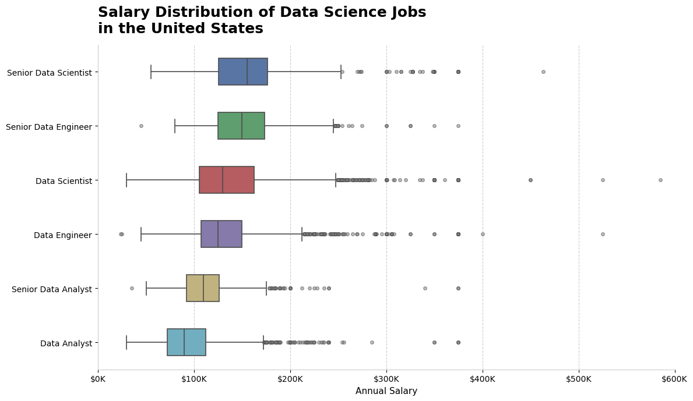
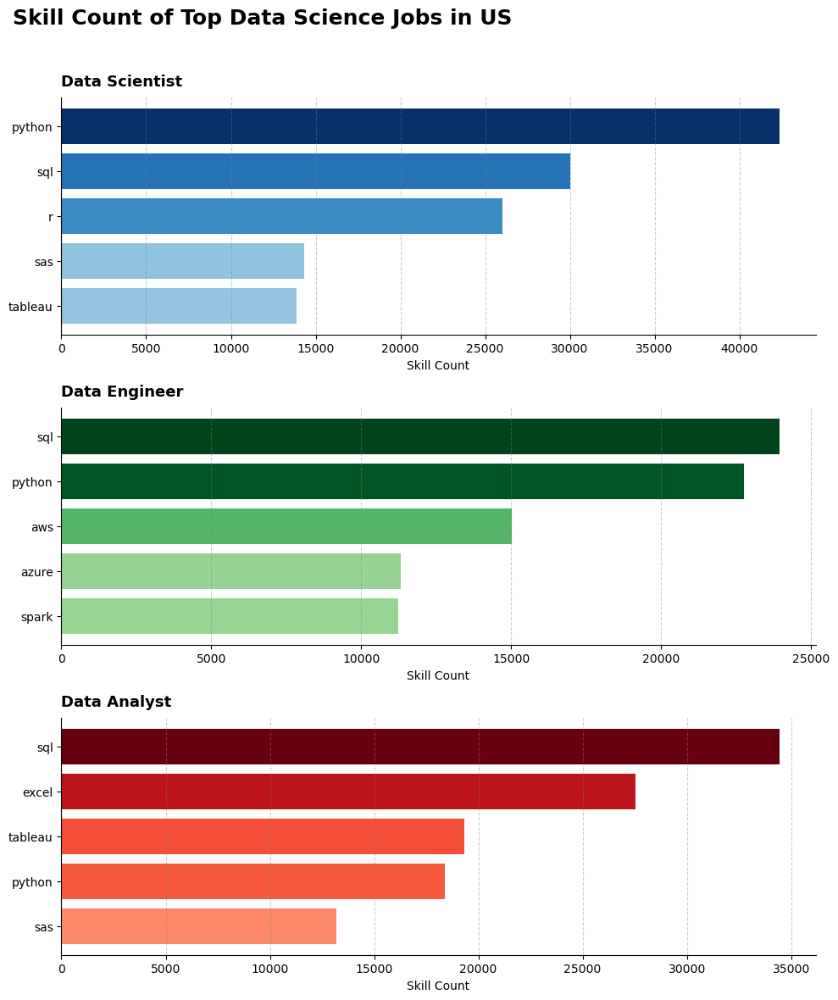
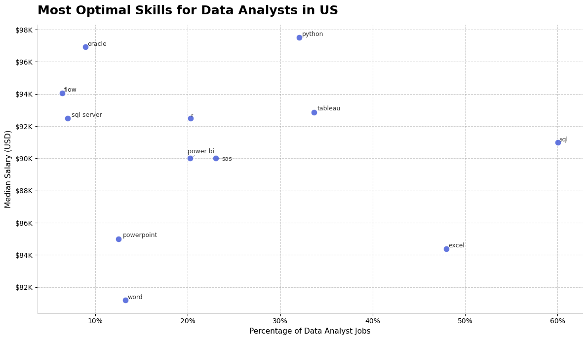
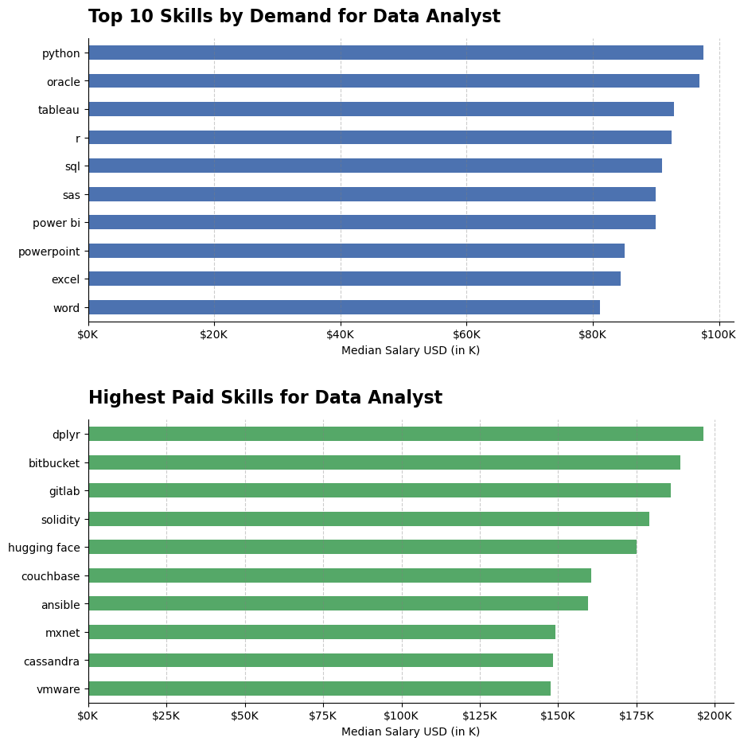
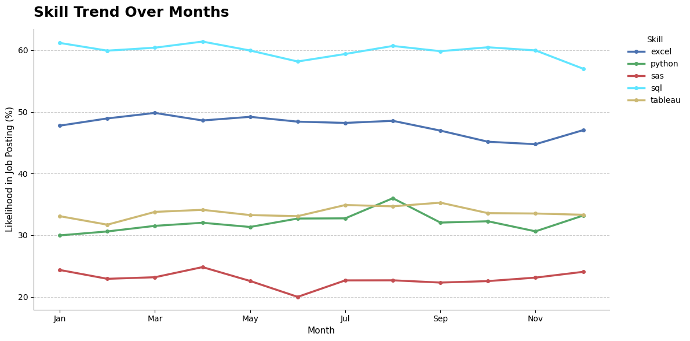

# Data Science & Analytics Job Market Optimization Study

## 📌 Project Overview
Navigating the data profession landscape can be challenging due to shifting technical demands and varying compensation models. This project builds an end-to-end data analysis pipeline evaluating over 170,000 U.S. data job postings from the real-world `lukebarousse/data_jobs` dataset. 

The core objective is to replace career guesswork with programmatic proof—uncovering definitive baseline salaries, identifying high-demand toolsets across job functions, mapping high-ROI "optimal" skills, and tracking macroeconomic seasonality trends.

---

## 🛠️ Tech Stack & Skills Demonstrated
* **Data Sourcing:** Hugging Face Hub API (`datasets`)
* **Data Wrangling & Manipulation:** `pandas`, text parsing of nested arrays via evaluation parsing (`ast.literal_eval`), matrix exploding (`df.explode()`), data serialization, and advanced time-series aggregation.
* **Data Visualization:** `matplotlib`, `seaborn`, dynamic string ticker configuration (`matplotlib.ticker`), and automatic layout adjustments using `adjustText`.

---

## 📊 Core Analytical Pipeline & Core Insights

### 1. Market-Wide Salary Distributions
* **Notebook:** [`notebooks/1_Salary_Dist_DSJobs.ipynb`](notebooks/1_Salary_Dist_DSJobs.ipynb)
* **Objective:** Establish baseline yearly compensations across major technical tracks in the United States.
* **Methodology:** Filtered data jobs specifically for target roles, processed null inputs, and created an optimized, color-mapped horizontal box plot detailing median markers, IQR spreads, and statistical outliers.
* **Key Insight:** Technical tracks like Data Engineering and Data Science maintain significantly higher median and baseline earning floors compared to standard analytical paths.

---

### 2. Segmented Tech Stack Requirements
* **Notebook:** [`notebooks/2_TopSkill_for_DS.ipynb`](notebooks/2_TopSkill_for_DS.ipynb)
* **Objective:** Map and isolate the specific technical tools required for the top 3 high-demand tracks.
* **Methodology:** Exploded the text-represented lists of technologies into categorical vectors, grouped frequency metrics, and designed a multi-subplot horizontal bar grid using graded colormaps.
* **Key Insight:** Isolated clean role delineations:
  * **Data Scientists:** Deep emphasis on `Python` and `SQL`, with solid `R` statistical baseline.
  * **Data Engineers:** Cloud-first processing engine focusing heavily on `SQL`, `Python`, `AWS`, and `Azure`.
  * **Data Analysts:** Traditional relational manipulation and data viz, maximizing `SQL`, `Excel`, and `Tableau`.

---

### 3. Identifying High-ROI "Optimal Skills"
* **Notebook:** [`notebooks/3_Most_optimal_skill.ipynb`](notebooks/3_Most_optimal_skill.ipynb)
* **Objective:** Pinpoint high-value strategic entry points—skills that are simultaneously in high demand *and* offer above-average compensation.
* **Methodology:** Combined percentage market likelihood with localized median salaries for U.S. Data Analyst roles. Plotted data on a dual-axis scatter graph, utilizing algorithmic text anchoring to eliminate overlapping labels.
* **Key Insight:** While foundational platforms like `SQL` and `Excel` command total market volume, scripting layers like `Python` sit beautifully in the optimal quadrant—offering solid demand (~32%) paired with premium median compensation (~$97,500).

---

### 4. Broad Market Demand vs. Niche Premium Pay
* **Notebook:** [`notebooks/4_Most_IDS_&_Highest_paid_skill.ipynb`](notebooks/4_Most_IDS_&_Highest_paid_skill.ipynb)
* **Objective:** Contrast standard highly adopted data tools against hyper-specialized technical integrations that demand premium hourly/annual payouts.
* **Methodology:** Constructed a dual-chart stacked axis layout directly mirroring market penetrations against top-tier median pay scales.
* **Key Insight:** Standard workflow applications provide a massive footprint for market entry, whereas specializing in enterprise database architectures or niche infrastructure pipelines accounts for clear jumps in overall salary bands.

---

### 5. Macroeconomic Time-Series Consistency
* **Notebook:** [`notebooks/5_Skill_Trend.ipynb`](notebooks/5_Skill_Trend.ipynb)
* **Objective:** Measure whether technology demand experiences volatile fluctuations or remains statically stable across a 12-month calendar horizon.
* **Methodology:** Extracted datetime objects into custom monthly dimensions, tracking percentage probabilities over time, and plotted via an optimized multi-line time-series graph.
* **Key Insight:** Hiring pipelines display highly consistent structural behavior over months. For instance, `SQL` tracks seamlessly as a dominant baseline constraint (~60% market baseline) throughout hiring cycles despite broader hiring freezes or seasonal volatility.

---

## 📈 Key Engineering & Design Highlights
* **Clean Code Architectural Separation:** No monolithic scripts; analysis paths are decoupled cleanly into modular, numbered notebooks.
* **Advanced Chart Formatting:** Cleaned default visualization clutter by removing unnecessary chart spines (`spines['top'].set_visible(False)`). Formatted messy raw numbers into highly scannable, human-readable labels (e.g., converting `$120000` to `$120K` and scales to percentages).
* **Defensive Wrangling:** Robust usage of string evaluation algorithms (`ast.literal_eval`) to safely interact with messy, nested JSON/string payload objects within raw data frames.
